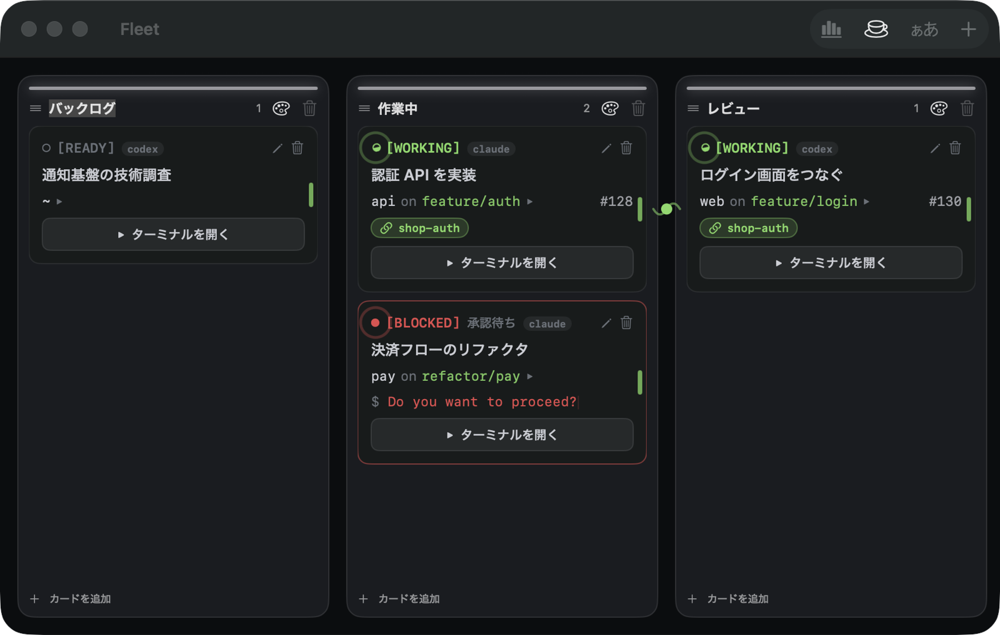

<p align="center">
  
</p>

<h1 align="center">Fleet</h1>

<p align="center">
  Claude Code / Codex エージェントのためのカンバン × ターミナル（macOS）。<br>
  どのエージェントが作業中か・承認待ちか・完了かを、ターミナルを開かずに把握。
</p>

<p align="center">
  <a href="https://fleet.fuwasegu.com">Website</a> ·
  <a href="https://github.com/fuwasegu/fleet/releases/latest">ダウンロード</a> ·
  <a href="README.md">English</a>
</p>

<p align="center">
  
  
</p>

## インストール

```sh
brew install --cask fuwasegu/tap/fleet
```

要件は **macOS 26+**。または [Releases](https://github.com/fuwasegu/fleet/releases/latest) から `Fleet.app.zip` を入手。

## スクリーンショット



## 特徴

- **本当に協調する Agent 群 (A2A)** — カードを曲線でつなぐと、その Agent 群が1つの文脈チャンネルに入る。同梱のローカル MCP サーバ経由で:
  - **共有メモリ** — `fleet_recall` / `fleet_remember`。種別(decision/blocker/artifact/question)と参照(ファイル/PR)を付与、「前回以降の新着」も取得可
  - **仲間のライブ状態** — `fleet_peers` で各 agent の状態(working/blocked/idle/done)・branch・PR・詰まっている内容が見える
  - **push と引き継ぎ** — `fleet_message` / `fleet_handoff` が相手の手が空いた瞬間にセッションへ直接届く(読まれないかもしれないノートではなく)
  - **衝突回避** — `fleet_claim` / `fleet_release` の advisory ロックで、同じリポジトリを触る agent 同士のファイル衝突を防ぐ
  - **盤面の操作** — `fleet_create_card` / `fleet_move_card` / `fleet_board`。agent がサブタスクを実カードとして切り出し(チャンネルに自動参加)、委譲できる

  並走する Agent が重複作業をやめて協調し始める。すべてローカル完結（クラウド不要）。
- **エージェントの状態を一目で** — 動作中 / 承認待ち / 完了 / 待機 を各ターミナルから自動検出（OSC タイトル + 構造照合、herdr 方式）。承認待ちカードにはエージェントの *実際の問い* を表示。
- **Claude Code と Codex** — カード毎にエージェント種別を選べる。どちらも A2A ツールが自動配線され（Claude は `--mcp-config`、Codex は `codex -c` の設定上書きで注入＝ユーザーの `~/.codex` 認証/設定はそのまま）、種別ごとの状態検知が効く。
- **Claude プロファイル** — 「会社」「個人」のようなラベルと `CLAUDE_CONFIG_DIR` のパスを組にした名前付きプロファイルを小さなシートで管理し、カードに割り当てられる。該当カードで `claude` を起動する際に Fleet がその `CLAUDE_CONFIG_DIR` を設定するので、カードごとに別の Claude アカウント/ライセンスを使い分けられる。セッション履歴や resume も同じ config dir を基準に解決される。Fleet が設定するのは環境変数だけで、そのディレクトリでのログイン自体は事前に済ませておく必要がある。
- **カードごとにフル装備のターミナル** — 各カードから本物のターミナル（SwiftTerm）を全画面起動。閉じてもセッションは動き続ける。
- **セッションが戻ってくる** — 各カードは自分の会話を自動復帰。開き直しても（アプリを再起動しても）エージェントが続きから再開する。別のセッションにしたい時は、直近会話プレビュー付きで履歴から選べる。
- **各カードに文脈を集約** — 作業ディレクトリ・git ブランチ・紐づく GitHub PR。Mermaid 図とシンタックスハイライト対応の Markdown プレビュー（完全オフライン）。
- **Git worktree を Fleet が管理** — カード作成時に既存フォルダの代わりに worktree を新規作成できる。リポジトリ・ブランチ名・ベース(現在のブランチ or デフォルトブランチ)を指定すると、Fleet が `git worktree add` を実行してカードに紐付ける(既定では `../.fleet-worktrees/<branch>` 配下)。Fleet がその worktree を所有し、ターミナルも直接そこで起動するので、worktree 作業中でも git ブランチ/PR の検出が正しく効く。削除も安全設計: Fleet が作った worktree しか削除せず、`--force` は使わず、未コミット/未 push の変更やセッション動作中は削除を拒否してカードだけ削除する選択肢を出す。agent 側からも `fleet_worktree_info` / `fleet_worktree_create` で自分のカードの worktree を参照・作成できる。
- **自分好みに** — ターミナルの配色テーマとフォント、トークン使用量ダッシュボード（今日 / 今週 / 今月 / 全期間）。
- **動くカンバン** — カードの列間移動、列の並べ替え、列ごとのアクセントカラー。
- **英語 / 日本語** — システム言語に追従。

## 要件

- macOS 26 以降
- [Claude Code](https://claude.com/claude-code)（各カードの中で動かすエージェント本体）

## 開発

Fleet は非サンドボックスの SwiftUI アプリ。Xcode プロジェクトは `project.yml` から [XcodeGen] で生成（`.xcodeproj` は git 管理外）。

```sh
brew install xcodegen
xcodegen generate
xcodebuild build -project Fleet.xcodeproj -scheme Fleet -destination 'platform=macOS'
xcodebuild test  -project Fleet.xcodeproj -scheme Fleet -destination 'platform=macOS'
```

<details>
<summary>リリース</summary>

`v*` タグを push すると、GitHub Actions がビルド → 自己署名 → GitHub Release 公開 → Homebrew cask 更新 まで自動実行する。

```sh
# project.yml の MARKETING_VERSION を上げてから:
git tag v1.2.3 && git push origin v1.2.3
```

配布ビルドは **自己署名**（notarize なし）。これにより更新をまたいで権限付与が維持され、Homebrew 版は cask がインストール時に検疫属性を除去する。詳細は [`docs/`](docs/) と [`docs/superpowers/specs/`](docs/superpowers/specs/)。

</details>

## ライセンス

MIT — [LICENSE](LICENSE) を参照。

[XcodeGen]: https://github.com/yonaskolb/XcodeGen
