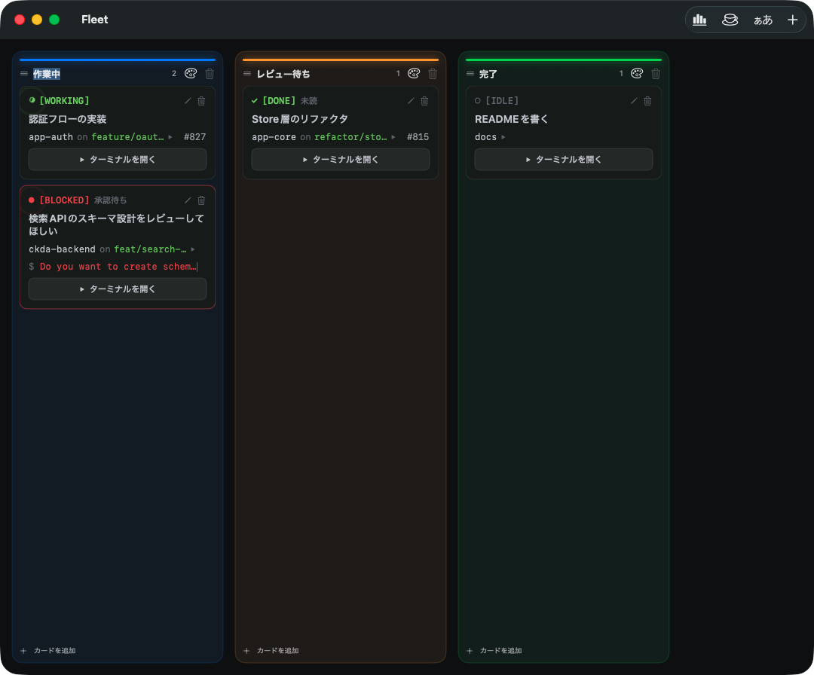

<p align="center">
  
</p>

<h1 align="center">Fleet</h1>

<p align="center">
  複数の Claude Code エージェントを「艦隊」として率いる、カンバン × ターミナルの macOS アプリ。<br>
  どのエージェントが動作中か・承認待ちか・完了したかを、ターミナルを開かずに一望。
</p>

<p align="center">
  <a href="https://fuwasegu.github.io/fleet/">Website</a> ·
  <a href="https://github.com/fuwasegu/fleet/releases/latest">ダウンロード</a> ·
  <a href="README.md">English</a>
</p>

<p align="center">
  
  
</p>

## インストール

```sh
brew install --cask fuwasegu/tap/fleet
```

要件は **macOS 26+**。または [Releases](https://github.com/fuwasegu/fleet/releases/latest) から `Fleet.app.zip` を入手。

## スクリーンショット



## 特徴

- **本当に協調する Agent 群 (A2A)** — カードを曲線でつなぐと、その Agent 群が1つの文脈チャンネルに入る。同梱のローカル MCP サーバ経由で、共有メモリの読み書き (`fleet_recall` / `fleet_remember`)、仲間の**ライブ状態**確認 (`fleet_peers`: working/blocked/idle、branch、PR)、そして相手のセッションへ直接メッセージを**push**・作業を引き継ぐ (`fleet_message` / `fleet_handoff`) ことができる。Fleet が相手の手が空いた瞬間に注入するので、並走する Agent が重複作業をやめて協調し始める。すべてローカル完結（クラウド不要）。
- **エージェントの状態を一目で** — 動作中 / 承認待ち / 完了 / 待機 を各ターミナルから自動検出（OSC タイトル + 構造照合、herdr 方式）。承認待ちカードにはエージェントの *実際の問い* を表示。
- **カードごとにフル装備のターミナル** — 各カードから本物のターミナル（SwiftTerm）を全画面起動。閉じてもセッションは動き続ける。
- **過去セッションから再開** — 以前の Claude Code セッションを直近会話のプレビュー付きで選んで `claude --resume`。誤ったセッションを掴まない。
- **各カードに文脈を集約** — 作業ディレクトリ・git ブランチ・紐づく GitHub PR。Mermaid 図とシンタックスハイライト対応の Markdown プレビュー（完全オフライン）。
- **自分好みに** — ターミナルの配色テーマとフォント、トークン使用量ダッシュボード（今日 / 今週 / 今月 / 全期間）。
- **動くカンバン** — カードの列間移動、列の並べ替え、列ごとのアクセントカラー。
- **英語 / 日本語** — システム言語に追従。

## 要件

- macOS 26 以降
- [Claude Code](https://claude.com/claude-code)（各カードの中で動かすエージェント本体）

## 開発

Fleet は非サンドボックスの SwiftUI アプリ。Xcode プロジェクトは `project.yml` から [XcodeGen] で生成（`.xcodeproj` は git 管理外）。

```sh
brew install xcodegen
xcodegen generate
xcodebuild build -project Fleet.xcodeproj -scheme Fleet -destination 'platform=macOS'
xcodebuild test  -project Fleet.xcodeproj -scheme Fleet -destination 'platform=macOS'
```

<details>
<summary>リリース</summary>

`v*` タグを push すると、GitHub Actions がビルド → 自己署名 → GitHub Release 公開 → Homebrew cask 更新 まで自動実行する。

```sh
# project.yml の MARKETING_VERSION を上げてから:
git tag v1.2.3 && git push origin v1.2.3
```

配布ビルドは **自己署名**（notarize なし）。これにより更新をまたいで権限付与が維持され、Homebrew 版は cask がインストール時に検疫属性を除去する。詳細は [`docs/`](docs/) と [`docs/superpowers/specs/`](docs/superpowers/specs/)。

</details>

## ライセンス

MIT — [LICENSE](LICENSE) を参照。

[XcodeGen]: https://github.com/yonaskolb/XcodeGen
