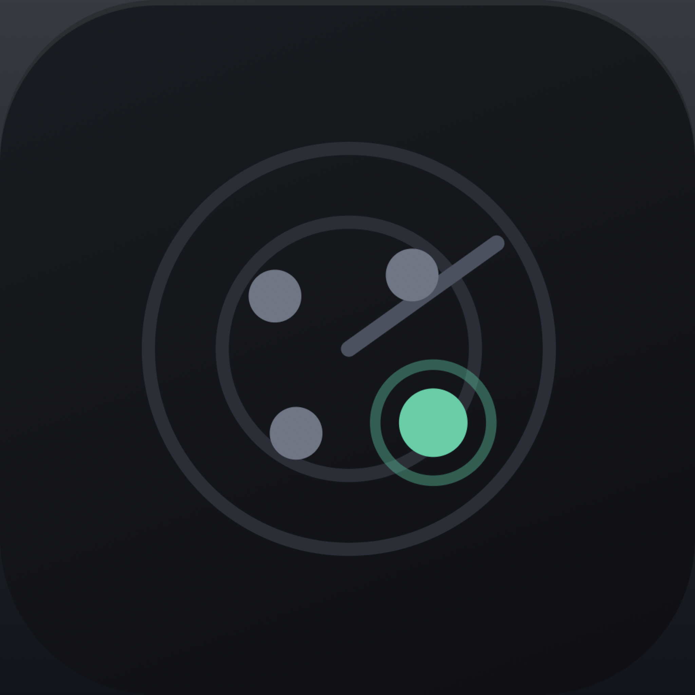
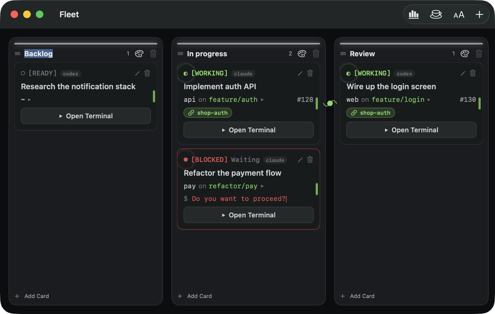

<p align="center">
  
</p>

<h1 align="center">Fleet</h1>

<p align="center">
  A Kanban board for your Claude Code and Codex agents, on macOS.<br>
  See which agent is working, waiting for approval, or done — without opening each terminal.
</p>

<p align="center">
  <a href="https://fleet.fuwasegu.com">Website</a> ·
  <a href="https://github.com/fuwasegu/fleet/releases/latest">Download</a> ·
  <a href="README.ja.md">日本語</a>
</p>

<p align="center">
  
  
</p>

## Install

```sh
brew install --cask fuwasegu/tap/fleet
```

Requires **macOS 26+**. Or grab `Fleet.app.zip` from [Releases](https://github.com/fuwasegu/fleet/releases/latest).

## Screenshot



## Features

- **Agents that actually collaborate (A2A)** — connect cards with a curve to put their agents in one context channel. Via a bundled local MCP server each agent can:
  - **share memory** — `fleet_recall` / `fleet_remember`, tagged by kind (decision / blocker / artifact / question) with file/PR refs, and "what's new since I last looked"
  - **see peers live** — `fleet_peers` shows each peer's status (working / blocked / idle / done), branch, PR, and what they're stuck on
  - **push & hand off** — `fleet_message` / `fleet_handoff` deliver straight into a peer's session the moment they're free (not a note they might never read)
  - **avoid clobbering** — `fleet_claim` / `fleet_release` advisory file locks for agents sharing a repo
  - **drive the board** — `fleet_create_card` / `fleet_move_card` / `fleet_board`: an agent can split off a subtask as a real card (which joins the channel) and delegate it

  Just link two cards on the board — the tools activate immediately, no restart needed. So parallel agents stop duplicating work and start coordinating. All local — no cloud.
- **Per-Fleet agent instructions** — write `~/.fleet/FLEET.md` (editable from Settings). Fleet reads it and injects it into every agent it launches via `--append-system-prompt` — so it applies only inside Fleet, without touching your repo's `CLAUDE.md` (e.g. "when I say 'share this', use the fleet tools").
- **Agent status at a glance** — Working / Blocked / Done / Idle, detected automatically from each terminal by a data-driven engine (OSC title + region/priority pattern rules, inspired by herdr). Blocked cards show the agent's *actual* question.
- **Claude Code and Codex** — choose the agent per card; both get the A2A tools wired in (Claude via `--mcp-config`, Codex injected through `codex -c` config overrides that keep your `~/.codex` auth/config intact) and kind-specific status detection.
- **A full terminal per card** — launch a real terminal (SwiftTerm) full-screen from any card; the session keeps running after you close it.
- **Sessions that come back** — every card auto-resumes its own conversation: reopen it (or relaunch Fleet) and the agent continues where it left off. Need a different one? Pick any past session from history with a preview of its last messages.
- **Context on every card** — working directory, git branch, and the linked GitHub PR. Built-in Markdown preview with Mermaid diagrams and syntax highlighting (fully offline).
- **Fleet-owned git worktrees** — create a card from a new worktree instead of an existing folder: give it a repo, a branch name, and a base (current branch or the default branch), and Fleet runs `git worktree add` and binds the card to it (under `../.fleet-worktrees/<branch>` by default). Because Fleet owns the worktree and launches the terminal inside it, git branch and PR detection stay correct — no more stale info from working in a worktree. Deletion is safe: Fleet only removes worktrees it created, never with `--force`, and refuses when there are uncommitted/unpushed changes or an active session (offering to delete just the card instead). Connected agents can query or create one for their own card via `fleet_worktree_info` / `fleet_worktree_create`.
- **Make it yours** — terminal color themes and fonts, plus a token-usage dashboard (today / this week / this month / all time).
- **A kanban that moves** — drag cards between columns, reorder columns, per-column accent colors.
- **Bilingual** — English / Japanese UI, following your system language.

## Requirements

- macOS 26 or later
- [Claude Code](https://claude.com/claude-code) (the agent you run inside each card)

## Development

Fleet is a non-sandboxed SwiftUI app. The Xcode project is generated from `project.yml` with [XcodeGen] (the `.xcodeproj` is not committed).

```sh
brew install xcodegen
xcodegen generate
xcodebuild build -project Fleet.xcodeproj -scheme Fleet -destination 'platform=macOS'
xcodebuild test  -project Fleet.xcodeproj -scheme Fleet -destination 'platform=macOS'
```

<details>
<summary>Releasing</summary>

Pushing a `v*` tag builds, self-signs, publishes a GitHub Release, and bumps the Homebrew cask automatically via GitHub Actions.

```sh
# bump MARKETING_VERSION in project.yml, then:
git tag v1.2.3 && git push origin v1.2.3
```

Distributed builds are **self-signed** (not notarized) so macOS remembers permission grants across updates; the Homebrew cask strips the quarantine flag on install. See [`docs/`](docs/) and the design specs under [`docs/superpowers/specs/`](docs/superpowers/specs/).

</details>

## License

MIT — see [LICENSE](LICENSE).

[XcodeGen]: https://github.com/yonaskolb/XcodeGen
